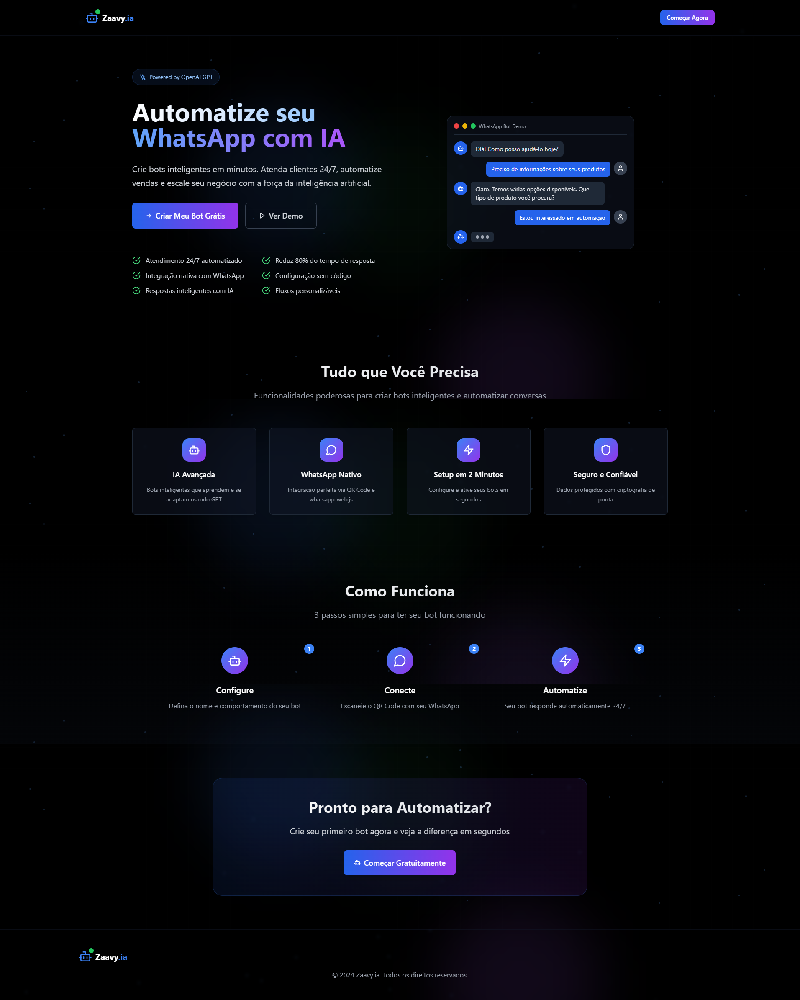
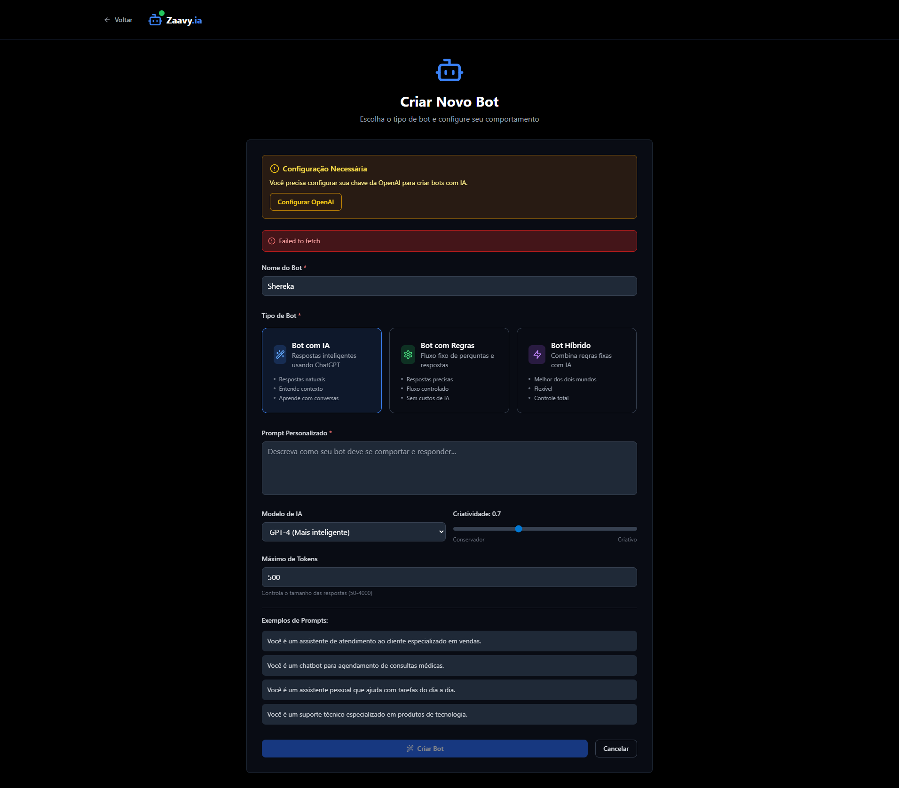

<p align="center">
    
</p>

<div align="center">


[](https://nodejs.org/)
[](https://reactjs.org/)
[](https://www.typescriptlang.org/)
[](https://www.prisma.io/)
[](https://openai.com/)
[](https://wwebjs.dev/)

[](https://opensource.org/licenses/MIT)
[](http://makeapullrequest.com)
[](https://github.com/SantiaGhou/Zaavy.ia/stargazers)

**Uma plataforma completa para criar e gerenciar bots inteligentes no WhatsApp usando OpenAI GPT e whatsapp-web.js**

  • [🐛 Reportar Bug](https://github.com/SantiaGhou/Zaavy.ia/issues) • [💡 Solicitar Feature](https://github.com/SantiaGhou/Zaavy.ia/issues) •

</div>

---

## ✨ Funcionalidades

### 🤖 **Tipos de Bots Inteligentes**
- **Bot com IA**: Respostas inteligentes usando GPT-3.5-turbo
- **Bot com Regras**: Fluxo fixo de perguntas e respostas
- **Bot Híbrido**: Combina regras fixas com inteligência artificial

### 🎨 **Interface Moderna**
- **Design Dark**: Interface elegante com tema escuro
- **Construtor Visual**: Drag-and-drop para criar fluxos
- **Dashboard Completo**: Estatísticas e métricas em tempo real
- **Responsivo**: Funciona perfeitamente em todos os dispositivos

### ⚡ **Funcionalidades Avançadas**
- **Conexão Real WhatsApp**: Via QR Code e whatsapp-web.js
- **Tempo Real**: Socket.IO para comunicação instantânea
- **Sessões Isoladas**: Cada bot tem sua própria sessão
- **Histórico Completo**: Todas as conversas são salvas
- **Prompts Personalizados**: Configure o comportamento de cada bot
- **Controle de Temperature**: Ajuste a criatividade das respostas
- **Múltiplos Modelos**: GPT-3.5, GPT-4 e variações
- **Base de Conhecimento**: Upload de PDFs para contexto
- **Controle em Tempo Real**: Pare/inicie bots instantaneamente
- **Sistema de Regras**: Fluxos personalizados com condições

---

## 🛠️ Stacks Tecnológicas

### **Frontend**
[](https://react.dev/)
[](https://www.typescriptlang.org/)
[](https://tailwindcss.com/)
[](https://lucide.dev/)
[](https://react.dev/reference/react/useContext)
[](https://socket.io/)
[](https://react-dropzone.js.org/)
[](https://www.npmjs.com/package/qrcode)

### **Backend**
[](https://nodejs.org/)
[](https://expressjs.com/)
[](https://wwebjs.dev/)
[](https://openai.com/)
[](https://www.prisma.io/)
[](https://www.sqlite.org/)
[](https://www.npmjs.com/package/pdf-parse)
[](https://www.npmjs.com/package/multer)
[](https://github.com/openai/tiktoken)
[](https://socket.io/)

### **DevOps & Ferramentas**
[](https://nodejs.org/api/esm.html)
[](https://www.npmjs.com/package/concurrently)
[](https://nodemon.io/)

---

## 🚀 Instalação e Configuração

### **Pré-requisitos**
- Node.js 18+ instalado
- Conta OpenAI com API Key
- WhatsApp instalado no celular

### **1. Clone o Repositório**
```bash
git clone https://github.com/SantiaGhou/Zaavy.ia.git
cd zaavy-ia
```

### **2. Instale as Dependências**
```bash
npm install
```

### **3. Configure as Variáveis de Ambiente**
Crie um arquivo `.env` na raiz do projeto:
```env
# OpenAI Configuration
OPENAI_API_KEY=sua_chave_openai_aqui

# Server Configuration
PORT=3001
NODE_ENV=development
FRONTEND_URL=http://localhost:5173

# Database
DATABASE_URL="file:./dev.db"
```

### **4. Configure o Banco de Dados**
```bash
# Gerar cliente Prisma
cd server && npx prisma generate

# Aplicar schema ao banco
npx prisma db push
```

### **5. Execute o Projeto**
```bash
# Executar frontend e backend simultaneamente
npm run dev

# Ou executar separadamente:
npm run dev:frontend  # Frontend (porta 5173)
npm run server        # Backend (porta 3001)
```

---

## 📖 Como Usar

### **1. 🎯 Acesso Rápido**
- Acesse `http://localhost:5173`
- Clique em "Começar Agora" - sem necessidade de cadastro!
- Uma sessão única é criada automaticamente

### **2. ⚙️ Configuração OpenAI**
- Configure sua chave da OpenAI no modal que aparece
- Obtenha sua chave em: [OpenAI Platform](https://platform.openai.com/account/api-keys)

### **3. 🤖 Criando Bots**

#### **Bot com IA**
1. Dashboard → "Criar Novo Bot"
2. Escolha "Bot com IA"
3. Configure nome e prompt personalizado
4. Escaneie o QR Code com seu WhatsApp
5. Pronto! Seu bot responde automaticamente

#### **Bot com Regras**
1. Dashboard → "Criar Novo Bot"
2. Escolha "Bot com Regras"
3. Use o construtor visual para criar o fluxo
4. Adicione condições e respostas
5. Teste e ative seu bot

#### **Bot Híbrido**
1. Combine regras fixas com blocos de IA
2. Configure prompts específicos para cada contexto
3. Máxima flexibilidade e controle

---

## 🎨 Screenshots

<div align="center">

### 🏠 Landing Page


### 📊 Dashboard


### 🛠️ Construtor de Bots



</div>

---

## 🏗️ Arquitetura do Projeto

```
zaavy-ia/
├── 📁 src/                          # Frontend React
│   ├── 📁 components/               # Componentes React
│   │   ├── 📁 pages/               # Páginas da aplicação
│   │   └── 📁 ui/                  # Componentes de UI
│   ├── 📁 context/                 # Context API
│   ├── 📁 services/                # Serviços e APIs
│   └── 📁 types/                   # Tipos TypeScript
├── 📁 server/                      # Backend Node.js
│   ├── 📁 config/                  # Configurações
│   ├── 📁 controllers/             # Controladores
│   ├── 📁 middleware/              # Middlewares
│   ├── 📁 routes/                  # Rotas da API
│   ├── 📁 services/                # Serviços do backend
│   └── 📁 sockets/                 # Handlers Socket.IO
├── 📁 prisma/                      # Schema do banco
└── 📄 package.json                 # Dependências
```

---

## 🔧 Scripts Disponíveis

```bash
# Desenvolvimento
npm run dev              # Frontend + Backend
npm run dev:frontend     # Apenas frontend
npm run server           # Apenas backend

# Banco de Dados
npm run db:generate      # Gerar cliente Prisma
npm run db:push          # Aplicar schema
npm run db:studio        # Interface visual do banco
npm run db:reset         # Resetar banco

# Produção
npm run build            # Build para produção
npm run preview          # Preview do build
```

---

## 🤝 Contribuindo

Contribuições são sempre bem-vindas! Veja como você pode ajudar:

### **1. 🍴 Fork o Projeto**
```bash
git clone https://github.com/SantiaGhou/Zaavy.ia.git
```

### **2. 🌿 Crie uma Branch**
```bash
git checkout -b feature/nova-funcionalidade
```

### **3. 💾 Commit suas Mudanças**
```bash
git commit -m "feat: adiciona nova funcionalidade incrível"
```

### **4. 📤 Push para a Branch**
```bash
git push origin feature/nova-funcionalidade
```

### **5. 🔄 Abra um Pull Request**

---

## 📋 Roadmap

### **🎯 Próximas Funcionalidades**
- [ ] 📊 Analytics avançados
- [ ] 🔄 Integração com outras plataformas
- [ ] 🎨 Temas personalizáveis
- [ ] 📱 App mobile
- [ ] 🌐 Suporte multi-idioma
- [ ] 🔐 Autenticação avançada
- [ ] 💾 Backup automático
- [ ] 📈 Métricas de performance

### **🐛 Melhorias Planejadas**
- [ ] Otimização de performance
- [ ] Testes automatizados
- [ ] Documentação expandida
- [ ] Docker support
- [ ] CI/CD pipeline


---

## 📊 Status do Projeto


---

## 👨‍💻 Autor

<div align="center">


**Desenvolvido com ❤️ por [SantiaGhou](https://github.com/SantiaGhou)**

[](https://github.com/SantiaGhou)
[](https://github.com/SantiaGhou/Zaavy.ia)
</div>

---

## 📄 Licença

Este projeto está sob a licença MIT. Veja o arquivo [LICENSE](LICENSE) para mais detalhes.

---
# Contato
Se você tiver alguma dúvida ou sugestão, entre em contato comigo através do meu [LinkedIn](https://www.linkedin.com/in/filipe-santiago-0736932b2/).


---

<div align="center">

**⭐ Se este projeto te ajudou, considere dar uma estrela!**

[](https://github.com/SantiaGhou/Zaavy.ia/stargazers)

</div>
